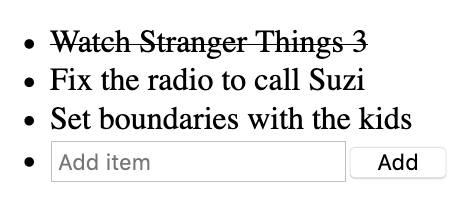
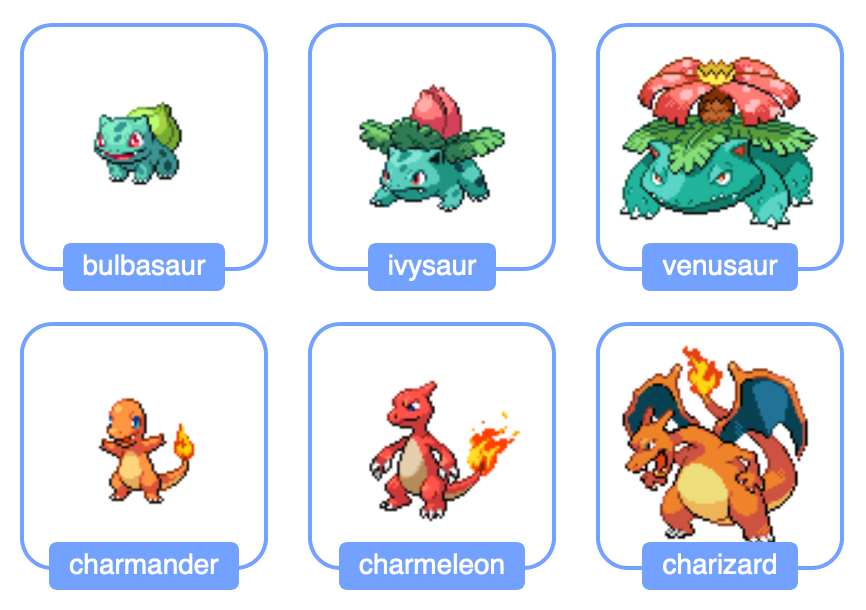

# Statux [](https://www.npmjs.com/package/statux) [](https://github.com/franciscop/statux/blob/master/.github/workflows/tests.yml) [](https://github.com/franciscop/statux/blob/master/index.min.js)

A minimal state management library with React [Hooks](#react-hooks) and [immutable state](#truly-immutable):

<a href="https://codesandbox.io/s/upbeat-swirles-q972b"></a>

It allows you to easily share any kind of state across different components of your WebApp with a simple and clean syntax.

Jump to docs for [`<Store>`](#store), [`useStore()`](#usestore), [`useSelector()`](#useselector), [`useActions()`](#useactions),  [*examples*](#examples).


## Getting started

First create a React project (try [Create-React-App](https://github.com/facebook/create-react-app)) and install `statux`:

```
npm install statux
```

Now we are going to initialize our store at the App root level with a couple of initial values:

```js
// src/App.js
import React from 'react';
import Store from 'statux'; // This library
import Website from './Website'; // Your code

// Initial state is { user: null, books: [] }
export default () => (
  <Store user={null} books={[]}>
    <Website />
  </Store>
);
```

Finally, use and update these values wherever you want:

```js
// src/User.js
import React from 'react';
import { useStore } from 'statux';

export default () => {
  const [user, setUser] = useStore('user');
  const login = () => setUser({ name: 'Maria' });
  return (
    <div>
      Hello {user ? user.name : (
        <button onClick={login}>Login</button>
      )}
    </div>
  )
};
```


## API

There are four pieces exported from the library:

- [**`<Store>`**](#store): the default export that should wrap your whole App. Its props define the store structure.
- [**`useStore(selector)`**](#usestore): extracts a part of the store for data retrieval and manipulation. Accepts a parameter to specify what subtree of the state to use.
- [**`useSelector(selector)`**](#useselector): retrieve a specific part of the store state based on the selector or the whole state if none was given.
- [**`useActions(selector)`**](#useactions): generate actions to modify the state while avoiding mutations. Includes default actions and can be extended.


### \<Store>

This should wrap your whole project, ideally in `src/App.js` or similar. You define the structure of all of your state within the `<Store>`:

```js
// src/App.js
import Store from 'statux';
import Navigation from './Navigation';

// state = { id: null, friends: [] }
export default () => (
  <Store id={null} friends={[]}>
    <Navigation />
  </Store>
);
```

When your state starts to grow - but not before - it is recommended to split it into a separated variable for clarity:

```js
// src/App.js
import Store from 'statux';
import Navigation from './Navigation';

const initialState = {
  id: null,
  friends: [],
  // ...
};

export default () => (
  <Store {...initialState}>
    <Navigation />
  </Store>
);
```

That's all you need to know for creating your state. When your app starts to grow, best-practices of redux like normalizing your state are recommended.


### useStore()

This is a [React hook](https://reactjs.org/docs/hooks-overview.html) to handle a state subtree. It accepts **a string selector** and returns an array similar to [React's `useState()`](https://reactjs.org/docs/hooks-state.html):

```js
import { useStore } from 'statux';

export default () => {
  const [user, setUser] = useStore('user');
  return (
    <div onClick={e => setUser({ name: 'Maria' })}>
      {user ? user.name : 'Anonymous'}
    </div>
  );
};
```

You can access deeper items and properties within your state through the selector:

```js
import { useStore } from 'statux';

export default () => {
  // If `user` is null, this will throw an error
  const [name = 'Anonymous', setName] = useStore('user.name');
  return (
    <div onClick={e => setName('John')}>
      {name}
    </div>
  );
};
```

It accepts a *string* selector that will find the corresponding state subtree, and also return a modifier for that subtree. `useStore()` behaves as the string selector for `useSelector()` and `useActions()` together:

```js
const [user, setUser] = useStore('user');
// Same as
const user = useSelector('user');
const setUser = useActions('user');
```

> Note: useStore() **only** accepts either a string selector or no selector at all; it **does not** accept ~~functions~~ or ~~objects~~ as parameters.

The first returned parameter is the frozen selected state subtree, and the second parameter is the setter. This setter is quite flexible:

```js
// Plain object to update it
setUser({ ...user, name: 'Francisco' });

// Function that accepts the current user
setUser(user => ({ ...user, name: 'Francisco' }));

// Modify only the specified props
setUser.assign({ name: 'Francisco' });
```

See the details and list of helpers on [the `useActions()` section](#useactions).


### useSelector()

This React hook retrieves a frozen (read-only) fragment of the state:

```js
import { useSelector } from 'statux';

export default () => {
  const user = useSelector('user');
  return <div>{user ? user.name : 'Anonymous'}</div>;
};
```

You can access deeper objects with the dot selector, which works both on objects and array indexes:

```js
import { useStore } from 'statux';

export default () => {
  const title = useSelector('books.0.title');
  const name = useSelector('user.name');
  return <div>{title} - by {name}</div>;
};
```

It accepts both a *string selector* and a *function selector* to find the state that we want:

```js
const user = useSelector('user');
const user = useSelector(({ user }) => user);
const user = useSelector(state => state.user);
```

You can dig for nested state, but if any of the intermediate trees is missing then it will fail:

```js
// Requires `user` to be an object
const name = useSelector('user.name');

// Can accept no user at all:
const user = useSelector(({ user }) => user ? user.name : 'Anonymous');

// This will dig the array friends -> 0
const bestFriend = useSelector('friends.0');
```


### useActions()

This React hook is used to modify the state in some way. Pass a selector to specify what state fragment to modify:

```js
const setState = useActions();
const setUser = useActions('user');
const setName = useActions('user.name');

// Update in multiple ways
setName('Francisco');
setName(name => 'San ' + name);
setName((name, key, state) => { ... });
```

These actions must be  executed within the appropriate callback:

```js
import { useActions } from 'statux';
import Form from 'your-form-library';

const ChangeName = () => {
  const setName = useActions('user.name');
  const onSubmit = ({ name }) => setName(name);
  return <Form onSubmit={onSubmit}>...</Form>;
};
```

There are several helper methods. These are based on/inspired by the array and object prototype linked in their names:

- [`fill()`](https://developer.mozilla.org/en-US/docs/Web/JavaScript/Reference/Global_Objects/Array/fill) (_array_): replace all items by the specified one.
- [`pop()`](https://developer.mozilla.org/en-US/docs/Web/JavaScript/Reference/Global_Objects/Array/pop) (_array_): remove the last item.
- [`push()`](https://developer.mozilla.org/en-US/docs/Web/JavaScript/Reference/Global_Objects/Array/push) (_array_): append an item to the end.
- [`reverse()`](https://developer.mozilla.org/en-US/docs/Web/JavaScript/Reference/Global_Objects/Array/reverse) (_array_): invert the order of the items.
- [`shift()`](https://developer.mozilla.org/en-US/docs/Web/JavaScript/Reference/Global_Objects/Array/shift) (_array_): remove the first item.
- [`sort()`](https://developer.mozilla.org/en-US/docs/Web/JavaScript/Reference/Global_Objects/Array/sort) (_array_): change the item order according to the passed function.
- [`splice()`](https://developer.mozilla.org/en-US/docs/Web/JavaScript/Reference/Global_Objects/Array/splice) (_array_): modify the items in varied ways.
- [`unshift()`](https://developer.mozilla.org/en-US/docs/Web/JavaScript/Reference/Global_Objects/Array/unshift) (_array_): prepend an item to the beginning.
- [`append()`]() (_array_): add an item to the end (alias of `push()`).
- [`prepend()`]() (_array_): add an item to the beginning (alias of `unshift()`).
- [`remove()`]() (_array_): remove an item by its index.
- [`assign()`](https://developer.mozilla.org/en-US/docs/Web/JavaScript/Reference/Global_Objects/Object/assign) (_object_): add new properties as specified in the argument.
- `remove()` (_object_): remove the specified property.
- `extend()` (_object_): add new properties as specified in the passed object (alias of `assign()`).

See them in action:

```js
// For the state of: books = ['a', 'b', 'c']
const { fill, pop, push, ...setBooks } = useActions('books');

fill(1);  // [1, 1, 1]
pop(); // ['a', 'b']
push('d'); // ['a', 'b', 'c', 'd']
setBooks.reverse(); // ['c', 'b', 'a']
setBooks.shift(); // ['b', 'c']
setBooks.sort(); // ['a', 'b', 'c']
setBooks.splice(1, 1, 'x'); // ['a', 'x', 'c']
setBooks.unshift('x'); // ['x', 'a', 'b', 'c']

// Aliases
setBooks.append('x');  // ['a', 'b', 'c', 'x']
setBooks.prepend('x');  // ['x', 'a', 'b', 'c']
setBooks.remove(1);  // ['a', 'c']

// These are immutable, but this still helps:
setBooks.concat('d', 'e');  // ['a', 'b', 'c', 'd', 'e']
setBooks.slice(1, 1);  // ['b']
setBooks.filter(item => /^(a|b)$/.test(item)); // ['a', 'b']
setBooks.map(book => book + '!'); // ['a!', 'b!', 'c!']
setBooks.reduce((all, book) => [...all, book + 'x'], []); // ['ax', 'bx', 'cx']
setBooks.reduceRight((all, book) => [...all, book], []); // ['c', 'b', 'a']

// For the state of: user = { id: 1, name: 'John' }
const setUser = useActions('user');
setUser(user => ({ ...user, name: 'Sarah' }));   // { id: 1, name: 'Sarah' }

setUser.assign({ name: 'Sarah' });  // { id: 1, name: 'Sarah' }
setUser.extend({ name: 'Sarah' });  // { id: 1, name: 'Sarah' }
setUser.remove('name');  // { id: 1 }
```

These methods can be extracted right in the actions or used as a method:

```js
const BookForm = () => {
  const setBooks = useActions('books');
  const onSubmit = book => setBooks.append(book);
  // OR
  const { append } = useActions('books');
  const onSubmit = book => append(book);

  return <Form onSubmit={onSubmit}>...</Form>;
};
```


## Examples

Some examples to show how *statux* works. Feel free to [suggest new ones](https://github.com/franciscop/statux/issues/new?template=suggest-example.md).

### Todo list

A TODO list in 30 lines ([**see codesandbox]**](https://codesandbox.io/s/elegant-tdd-c8jlq)):



```js
// App.js
export default () => (
  <Store todo={[]}>
    <h1>TODO List:</h1>
    <TodoList />
  </Store>
);
```

```js
// TodoList.js
import { useStore } from "statux";
import React from "react";
import Form from "form-mate";

function TodoItem({ index }) {
  const [item, setItem] = useStore(`todo.${index}`);
  return (
    <li onClick={() => setItem.assign({ done: !item.done })}>
      {item.done ? <strike>{item.text}</strike> : item.text}
    </li>
  );
}

export default function TodoList() {
  const [todo, { append }] = useStore("todo");
  return (
    <ul>
      {todo.map((item, i) => (
        <TodoItem key={item.text} index={i} />
      ))}
      <li>
        <Form onSubmit={append} autoReset>
          <input name="text" placeholder="Add item" />
          <button>Add</button>
        </Form>
      </li>
    </ul>
  );
}
```

### Initial data loading

Load a pokemon list with graphics from an API ([**see codesandbox**](https://codesandbox.io/s/elastic-glitter-crofz)):



```js
// src/App.js
import Store from 'statux';
import React from 'react';
import PokemonList from './PokemonList';

export default () => (
  <Store pokemon={[]}>
    <h1>The Best 151:</h1>
    <PokemonList />
  </Store>
);
```

```js
// src/PokemonList.js
import { useStore } from "statux";
import React, { useEffect } from "react";
import styled from "styled-components";

const url = "https://pokeapi.co/api/v2/pokemon/?limit=151";
const catchAll = () =>
  fetch(url)
    .then(r => r.json())
    .then(r => r.results);

const Pokemon = ({ id, children }) => <li id={id}>{children}</li>;

export default () => {
  const [pokemon, setPokemon] = useStore("pokemon");
  useEffect(() => {
    catchAll().then(setPokemon);
  }, []);
  if (!pokemon.length) return "Loading...";
  return (
    <ul>
      {pokemon.map((poke, i) => (
        <li key={i} id={i + 1}>
          <Label>{poke.name}</Label>
        </li>
      ))}
    </ul>
  );
};
```


### API calls

You can combine Statux with API calls as usual. For example, you might have a local token to verify on an API:

```js
// UserProfile.js - omitted unmounted check and error handling for brevity
import React from 'react';
import { useStore } from 'statux';
import useAsyncEffect from 'use-async-effect';
import axios from 'axios';

export default () => {
  const token = localStorage.token;
  const [user, setUser] = useStore('user');

  // Use your favourite async effect
  useAsyncEffect(async () => {
    // The user was never logged in
    if (!token) return;
    const { data } = await axios.post('/api/user', { token });
    setUser(data);
  }, []);

  if (token) {
    if (!user) return 'Loading...';
    return <p>Hello {user.name}</p>;
  } else {
    // Defined below
    return <Login />;
  }
}
```

> Tip: we are using [`axios`](https://github.com/axios/axios) and [`use-async-effect`](https://www.npmjs.com/package/use-async-effect) to handle async API requests.

The Login.js could be defined like this:

```js
import { useActions } from 'statux';
import Form from 'form-mate';

// Login.js
export default () => {
  const setUser = useActions('user');
  const onSubmit = async data => {
    const { data } = await axios.post('/login', data);
    localStorage.token = data.token;
    setUser(data.user);
  };
  return (
    <Form onSubmit={onSubmit}>
      {...}
    </Form>
  );
}
```


### Login and localStorage

Let's say our webapp is smaller, and we want to keep the TODO list in localStorage:

```js
import React from "react";
import Store, { useSelector } from "statux";

// Define the initial state as an object:
const todo = JSON.parse(localStorage.todo || '[]');

// Save this state fragment when it changes:
const LocalStorage = () => {
  const todo = useSelector('todo');
  localStorage.todo = JSON.stringify(todo);
  return null;
};

export default () => (
  <Store todo={todo}>
    <LocalStorage />
    ...
  </Store>
);
```

This can be applied to Dark Mode as well, since localStorage is sync we can read it before running any React to avoid flashing a white screen first:

```js
import React from "react";
import Store, { useSelector } from "statux";

// Define the initial state as an object:
const dark = Boolean(localStorage.dark);

// Save this state fragment when it changes:
const LocalStorage = () => {
  const dark = useSelector('dark');
  localStorage.dark = JSON.stringify(dark);
  return null;
};

export default () => (
  <Store dark={dark}>
    <LocalStorage />
    ...
  </Store>
);
```


### Reset initial state

To reset the initial state we should first keep it separated, and then trigger a reset from the root state ([**see codesandbox**](https://codesandbox.io/s/elastic-haslett-njqjr)):

```js
import React from "react";
import Store, { useActions, useStore } from "statux";

// Define the initial state as an object
const init = { user: null, todo: [] };

// We then trigger a useActions without any selector
const ResetState = () => {
  const setState = useActions();
  const reset = () => setState(init);
  return <button onClick={reset}>Clear</button>;
};

const Login = () => {
  const [user, setUser] = useStore("user");
  const login = () => setUser("Mike");
  if (user) return <p>Hi {user}</p>;
  return (
    <p>
      <button onClick={login}>Login</button>
    </p>
  );
};

export default () => (
  <Store {...init}>
    <ResetState />
    <Login />
  </Store>
);
```


## Motivation

Why did I create Statux instead of using useState+useContext() or Redux? I built a library that sits between the simple but local React Hooks and the solid but complex full Flux architecture. There are few reasons that you might care about:


### React Hooks

When there's a major shift on a technology it's a good chance to reevaluate our choices. And React Hooks is no different, our components are now cleaner and the code is easier to reuse than ever.

So I wanted a *minimal* library that follows React Hooks' pattern of accessing and writing state, but on an app-level instead of a component-level. I tried with Context for a while, but found that you have to create many contexts to avoid some issues ([by design](https://github.com/facebook/react/issues/15156#issuecomment-474590693)) and found that too cumbersome. I just wanted `useState`, but globally.

So here it is, now you can use `useStore()` as a global `useState()`. I've followed Hooks' syntax where possible, with differences only when needed e.g. not initial state on a component-level since that's global:

```js
const [user, setUser] = useState(null);  // React Hooks
const [user, setUser] = useStore('user');  // Statux
```


### Direct manipulation

With Statux you directly define the state you want on your actions. You remove [a full layer of indirection](https://twitter.com/dan_abramov/status/802564042648944642) by **not** following the [Flux architecture](https://www.youtube.com/watch?v=nYkdrAPrdcw).

This removes a lot of boilerplate commonly seen on apps that use Redux. Where many would define the reducers, actions, action creators, thunk action creators, etc. with Statux you change your state directly:

```js
export default function UserProfile() {
  const [user, setUser] = useStore('user');
  if (!user) {
    const login = () => setUser('Mike');
    return <button onClick={login}>Login</button>
  }
  return user;
}
```

This has a disadvantage for very large and complex apps (100+ components) where the coupling of state and actions make changes in the state structure around twice as hard. But if [you are following this Redux antipattern](https://rangle.slides.com/yazanalaboudi/deck) you might not really need Redux, so give Statux a try and it *will* simplify your code.


### Truly immutable

The whole state is [frozen with `Object.freeze()`](https://developer.mozilla.org/en-US/docs/Web/JavaScript/Reference/Global_Objects/Object/freeze) so no accidental mutation can drive subtle bugs and stale state. Try mutating the state of your app for testing ([**see demo**](https://codesandbox.io/s/gallant-firefly-59684)):

```js
const App = () => {
  const [user] = useStore("user");
  // TypeError - can't define property "name"; Object is not extensible
  user.name = 'John';
  return <div>{user.name}</div>;
};
```

This will avoid whole categories of bugs for newbies working on your team and experienced devs as well:

- `arr.sort((a, b) => {...}).map()` is also mutating the original array.
- `setValue(value++)` will mutate the original value.

When you try to mutate the state directly it will throw a TypeError. Instead, try defining a new variable if you indeed want to read it with a default:

```js
const App = () => {
  const [user] = useStore("user");
  const name = user.name || 'John';
  return <div>{name}</div>;
};
```

Or directly access the name with the correct selector and a default if you know `user` is defined:

```js
const App = () => {
  const [name = 'John'] = useStore("user.name");
  return <div>{name}</div>;
};
```

Statux also provides some helpers for modifying the state easily:

```js
// Set the name of the user
const onClick = name => setUser({ ...user, name });
const onClick = name => setUser(user => ({ ...user, name }));
const onClick = name => setUser.assign({ name });

// Add a book to the list
const onSubmit = book => setBooks([...books, book]);
const onSubmit = book => setBooks(books => [...books, book]);
const onSubmit = book => setBooks.append(book);
```
